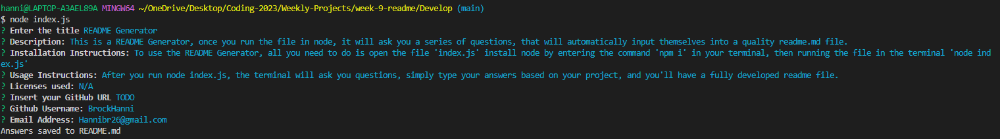

# README Generator

This is a README Generator, once you run the file in node, it will ask you a series of questions, that will automatically input themselves into a quality readme.md file.

## Installation

To use the README Generator, all you need to do is open the file 'index.js' install node by entering the command 'npm i' in your terminal, then running the file in the terminal 'node index.js'

## Usage

After you run node index.js, the terminal will ask you questions, simply type your answers based on your project, and you'll have a fully developed readme file.

## Tests

To run tests, run node index.js, and answer the questions, then check the readme file that is generated.

## Contributing/Contact

To submit bug reports, feature requests, or pull requests, please email me at Hannibr26@gmail.com, or visit my GitHub page: BrockHanni(https://github.com/BrockHanni)

## License

Licenses used: N/A

## Deployment

Deployed application: https://brockhanni.github.io/week-9-readme/

Assignment repository: https://github.com/BrockHanni/week-9-readme

## Screenshots

https://github.com/BrockHanni/week-9-readme/assets/106788919/9a833f4f-1a90-4ce8-8660-63bc535aa1e0

## Table of Contents

- [Installation](#installation)
- [Usage](#usage)
- [Tests](#tests)
- [Contributing/Contact](#contributing/Contact)
- [License](#license)
- [Deployment](#deployment)
- [Screenshots](#screenshots)
- [Table of Contents](#table-of-contents)

